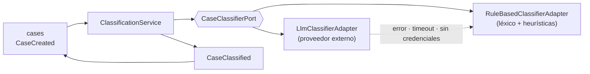

# Integración de IA — clasificación de solicitudes

## Objetivo

Al radicarse un caso, sugerir **categoría**, **prioridad**, **área responsable** y detectar
**señales de urgencia**, a partir del texto libre. La sugerencia siempre es revisable por
una persona, salvo la escalada crítica, que actúa de inmediato.

## Diseño: puerto y adaptadores

El dominio depende de una interfaz, no de un proveedor
([ADR-0003](../06-adr/adr-0003-ia-tras-puerto.md)):

```java
// ai/application/port/CaseClassifierPort.java
public interface CaseClassifierPort {
    ClassificationResult classify(ClassificationRequest request);
}
```



| Adaptador | Cuándo actúa | Confianza típica |
|---|---|---|
| `LlmClassifierAdapter` | Por defecto, si hay credenciales configuradas | 0.6 – 0.98 |
| `RuleBasedClassifierAdapter` | Sin credenciales, ante error, timeout (5 s) o respuesta inválida | 0.3 – 0.7 |

Con el adaptador de respaldo el caso queda en `PENDING_REVIEW` y se marca visualmente para
que una persona lo revise. **El servicio nunca se bloquea por la IA.**

## Flujo

1. `POST /cases` persiste el caso con `status = SUBMITTED` y responde de inmediato.
2. Tras el commit se publica `CaseCreated` y se encola un trabajo en `sys_async_jobs`.
3. El trabajador seudonimiza el texto y llama al puerto.
4. El resultado se guarda en `cas_classifications` y actualiza el caso.
5. Si hay señal crítica, se notifica al área de psicología sin esperar revisión humana.
6. La persona que atiende confirma o corrige; la corrección alimenta la métrica de precisión.

## Seudonimización (obligatoria antes de salir del sistema)

Antes de enviar texto a un proveedor externo se sustituyen, por expresión regular y por
cotejo contra el expediente:

| Dato | Reemplazo |
|---|---|
| Nombres y apellidos del expediente | `[NOMBRE]` |
| Número de documento | `[DOCUMENTO]` |
| Correos | `[CORREO]` |
| Teléfonos | `[TELEFONO]` |
| Códigos de estudiante | `[CODIGO]` |

Nunca se envían: identificadores internos, historial completo del estudiante ni puntaje de
riesgo. Solo el texto del caso en cuestión.

## Contrato del prompt

Vive versionado en `src/main/resources/prompts/`. Estructura:

- **Sistema**: rol del clasificador, taxonomía cerrada, obligación de responder JSON válido,
  prohibición de diagnosticar y de inventar categorías fuera de la lista.
- **Usuario**: título y descripción seudonimizados, origen del caso (`SELF`/`STAFF`).
- **Salida esperada** (JSON estricto, validado contra esquema antes de aceptarse):

```json
{
  "category": "PSYCHOLOGICAL",
  "priority": "HIGH",
  "handling_unit": "PSYCHOLOGY",
  "confidence": 0.87,
  "urgency_signals": ["SELF_HARM_MENTION"],
  "rationale": "Menciona desesperanza sostenida y aislamiento en las últimas semanas."
}
```

Reglas de validación de la respuesta:
- `category`, `priority` y `handling_unit` deben pertenecer a la [taxonomía](../03-especificaciones/reglas/taxonomia-clasificacion.md); si no, se descarta y actúa el respaldo.
- `confidence < 0.55` ⇒ el caso queda `PENDING_REVIEW` aunque la respuesta sea válida.
- `rationale` se guarda pero **no se muestra al estudiante**.

## Clasificador de respaldo por reglas

Léxico ponderado por categoría, en `resources/classification/lexicon-es.yml`. Puntúa por
coincidencias normalizadas (sin tildes, en minúsculas, con lematización simple) y escoge la
categoría de mayor puntaje. Las expresiones de la lista de urgencia se evalúan **siempre**,
con ambos adaptadores, como red de seguridad independiente del LLM.

## Guardas y ética

| Guarda | Regla |
|---|---|
| G1 | La IA **sugiere**, no decide: nadie recibe atención ni deja de recibirla por su salida. |
| G2 | La escalada crítica es la única acción automática, y solo **suma** atención humana. |
| G3 | No se genera diagnóstico ni recomendación clínica; el prompt lo prohíbe explícitamente. |
| G4 | Todo dato enviado al proveedor está seudonimizado y queda registrado en auditoría. |
| G5 | El proveedor debe ofrecer no-entrenamiento con los datos enviados; si no, se usa el respaldo. |
| G6 | La precisión se mide y se publica; si cae bajo el 60 % de aceptación, la sugerencia se oculta hasta recalibrar. |

## Configuración

```yaml
ustudent:
  ai:
    enabled: true
    provider: anthropic        # anthropic | rules
    model: claude-sonnet-5
    timeout-ms: 5000
    max-retries: 2
    min-confidence: 0.55
    pseudonymize: true         # no se permite desactivar en producción
```

Las credenciales se leen de variables de entorno; nunca del repositorio.
