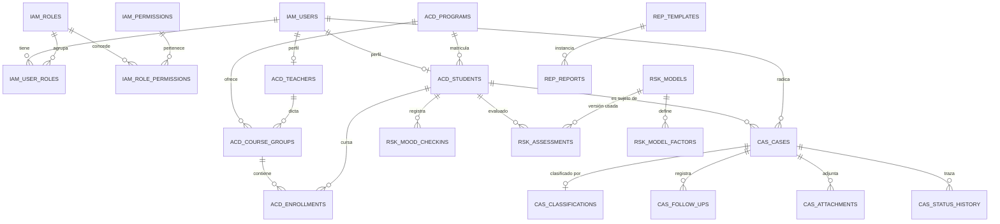

# Modelo de datos

PostgreSQL 16. Nombres de tabla en inglés, `snake_case`, plural. Toda tabla lleva
`id bigserial` (interna), `public_id uuid` (expuesta en la API), `created_at`, `updated_at`.

## Esquemas lógicos

Un solo esquema físico `public`, con prefijos por módulo para hacer visible la frontera:

| Prefijo | Módulo |
|---|---|
| `iam_` | usuarios, roles, permisos, sesiones |
| `acd_` | estudiantes, docentes, programas, grupos, matrículas |
| `cas_` | casos, clasificaciones, seguimientos, adjuntos |
| `rsk_` | modelos, factores, evaluaciones, check-ins de ánimo |
| `rep_` | plantillas e informes generados |
| `sys_` | auditoría, trabajos asíncronos, parámetros |

## Diagrama entidad-relación

## Tablas principales

### `iam_users`
| Columna | Tipo | Notas |
|---|---|---|
| `email` | `citext` | único, dominio institucional |
| `document_number` | `varchar(20)` | único |
| `password_hash` | `varchar(72)` | BCrypt |
| `full_name` | `varchar(160)` | |
| `status` | `varchar(20)` | `ACTIVE` · `INACTIVE` · `LOCKED` |
| `failed_attempts` | `smallint` | bloqueo tras 5 |
| `last_login_at` | `timestamptz` | |

`iam_roles(code, name, description, is_system)` · `iam_permissions(code, resource, action)` ·
tablas puente `iam_user_roles` e `iam_role_permissions`.
`is_system = true` protege los cinco roles predefinidos de ser borrados.

### `acd_students`
`user_id` (FK única), `program_id`, `student_code`, `admission_period`, `current_semester`,
`status` (`ACTIVE` · `ON_LEAVE` · `GRADUATED` · `WITHDRAWN`), `withdrawn_at`.

`withdrawn_at` es la etiqueta real que permitirá, más adelante, validar el poder predictivo
del motor de riesgo.

### `cas_cases`
| Columna | Tipo | Notas |
|---|---|---|
| `case_number` | `varchar(20)` | radicado legible: `US-2026-000123` |
| `origin` | `varchar(10)` | `SELF` · `STAFF` |
| `reporter_user_id` | FK `iam_users` | quién radicó |
| `subject_student_id` | FK `acd_students` | de quién trata — **siempre presente** |
| `title` | `varchar(160)` | |
| `description` | `text` | cifrado en reposo |
| `category` | `varchar(40)` | categoría final confirmada |
| `priority` | `varchar(10)` | `LOW` · `MEDIUM` · `HIGH` · `CRITICAL` |
| `handling_unit` | `varchar(40)` | área responsable |
| `status` | `varchar(24)` | ver [ciclo de vida](../04-diagramas/estados/ciclo-vida-caso.md) |
| `is_confidential` | `boolean` | restringe la visibilidad por fila |
| `assignee_user_id` | FK `iam_users` | nullable |
| `submitted_at` · `first_response_at` · `resolved_at` · `closed_at` | `timestamptz` | métricas de servicio |
| `closure_reason` | `varchar(40)` | obligatorio al cerrar |

Índices: `(subject_student_id, submitted_at desc)`, `(status, priority)`,
`(assignee_user_id, status)`, GIN sobre `to_tsvector('spanish', title)`.

### `cas_classifications`
Guarda lo que sugirió el clasificador **y** lo que decidió la persona, para poder medir
precisión: `case_id`, `suggested_category`, `suggested_priority`, `suggested_unit`,
`confidence numeric(4,3)`, `provider` (`LLM` · `RULES`), `model_name`, `raw_response jsonb`,
`reviewed_by_user_id`, `reviewed_at`, `was_corrected boolean`.

### `rsk_mood_checkins`
`student_id`, `score smallint` (1–5), `tags text[]`, `comment text` (cifrado),
`created_at`. Restricción única por `(student_id, date(created_at))`.

### `rsk_models` / `rsk_model_factors`
`rsk_models(version, name, is_active, thresholds jsonb, activated_at, created_by)` —
solo un modelo activo a la vez.
`rsk_model_factors(model_id, code, label, weight numeric(5,2), params jsonb, enabled)`.
Los pesos y umbrales son **datos**, no código.

### `rsk_assessments`
`student_id`, `model_id`, `score numeric(5,2)`, `level varchar(12)`,
`factor_breakdown jsonb`, `computed_at`, `trigger varchar(30)` (`CASE_CHANGE` ·
`MOOD_CHECKIN` · `SCHEDULED` · `MANUAL`).

`factor_breakdown` conserva por factor su valor observado, su peso y los puntos aportados:
sin ese detalle el puntaje no se muestra ([US-E5-3](../01-requisitos/historias-usuario.md)).
Se guarda histórico: cada recálculo inserta una fila nueva, nunca actualiza.

### `sys_audit_log`
`actor_user_id`, `action`, `resource_type`, `resource_id`, `metadata jsonb`, `ip_address`,
`user_agent`, `occurred_at`. Tabla **append-only**: sin `UPDATE` ni `DELETE` concedidos al
usuario de la aplicación.

### `sys_async_jobs`
`type`, `payload jsonb`, `status` (`PENDING` · `RUNNING` · `DONE` · `FAILED`), `attempts`,
`last_error`, `run_after`. Sustituye a un broker en la v1; permite reintento con retroceso
exponencial de la clasificación y de los correos.

## Reglas de integridad

1. Un caso siempre tiene `subject_student_id`, incluso si el radicador es el estudiante.
2. `closure_reason` es obligatorio cuando `status = CLOSED` (restricción `CHECK`).
3. `first_response_at` no puede ser anterior a `submitted_at`.
4. Un check-in por estudiante y día.
5. Solo un `rsk_models.is_active = true` (índice único parcial).
6. Borrado de usuarios: **lógico**. Nunca se elimina físicamente un usuario con casos.
7. Las evaluaciones históricas mantienen la FK al modelo con el que se calcularon, aunque
   ese modelo ya no esté activo.
