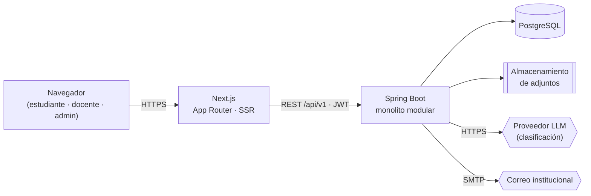
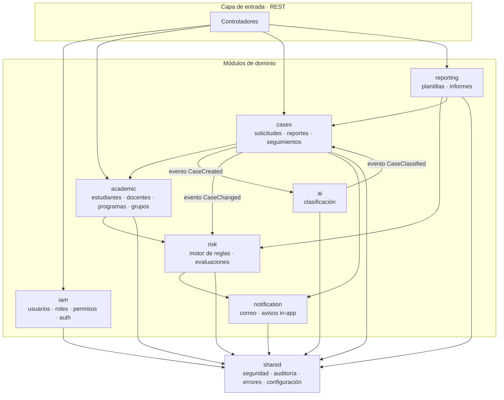

# Vista de arquitectura

## Estilo

**Cliente-servidor con backend monolítico modular.** Un solo despliegue de Spring Boot que
expone una API REST versionada, consumida por un cliente Next.js. Internamente el monolito
está partido en módulos con fronteras explícitas, de modo que un módulo pueda extraerse a
servicio propio si algún día hace falta, sin que eso sea un objetivo hoy
([ADR-0001](../06-adr/adr-0001-monolito-modular.md)).



## Stack

| Capa | Tecnología | Motivo |
|---|---|---|
| Frontend | Next.js 16 (App Router), TypeScript, Tailwind CSS, TanStack Query, Recharts | SSR para vistas protegidas, tipado extremo a extremo, gráficas del tablero |
| Backend | Spring Boot 4.1, Java 21, Spring WebMVC, Spring Security 7, Spring Data JPA, Validation | Estándar del equipo, ecosistema maduro para RBAC y JPA |
| Base de datos | PostgreSQL 16 | Relacional, JSONB para el detalle de factores de riesgo ([ADR-0002](../06-adr/adr-0002-postgresql.md)) |
| Migraciones | Flyway | Esquema versionado y reproducible |
| Documentación API | springdoc-openapi 3.x | OpenAPI generado desde el código (la línea 2.x solo sirve para Boot 3.x) |
| Asincronía | `@Async` + tabla de trabajos pendientes | Clasificación y notificaciones sin bloquear la respuesta; sin broker externo en v1 |
| Programación | Spring Scheduler | Recálculo diario de riesgo |
| Pruebas | JUnit 5, Mockito, Testcontainers, ArchUnit, Playwright | Unidad, integración real contra Postgres, fronteras de módulos, E2E |

## Módulos del backend



### Reglas de dependencia entre módulos

1. Ningún módulo accede a las tablas de otro módulo. La comunicación es por **interfaz de
   aplicación pública** (`application/port`) o por **evento de dominio**.
2. `shared` no depende de ningún módulo de dominio. Todos pueden depender de `shared`.
3. Las dependencias entre módulos forman un grafo **acíclico**; los ciclos aparentes
   (`cases ↔ ai`) se rompen con eventos.
4. Estas reglas se verifican en CI con ArchUnit; romperlas falla el build.

### Capas dentro de cada módulo

```
<módulo>/
├── api/                  Controladores REST + DTO. Sin lógica de negocio.
│   └── dto/
├── application/          Casos de uso, transacciones, orquestación.
│   ├── port/             Interfaces hacia afuera (IA, correo, almacenamiento).
│   └── service/
├── domain/               Entidades, objetos de valor, reglas invariantes.
│   ├── model/
│   └── repository/       Interfaces de repositorio.
└── infrastructure/       Implementaciones: JPA, clientes HTTP, adaptadores.
    ├── persistence/
    └── adapter/
```

La regla de dependencia apunta **hacia adentro**: `api → application → domain`, e
`infrastructure → domain` implementando sus interfaces. El dominio no conoce Spring ni JPA
en sus reglas de negocio.

## Frontend

```
src/
├── app/            Rutas del App Router, agrupadas por audiencia
│   ├── (public)/   Landing, información institucional
│   ├── (auth)/     Login, recuperación de contraseña
│   └── (app)/      Área autenticada: estudiante · docente · admin
├── features/       Lógica por dominio: hooks de datos, esquemas Zod, componentes propios
├── components/     UI transversal: ui/ (primitivos), layout/, charts/, forms/
├── lib/            Cliente HTTP, sesión, utilidades, hooks genéricos
├── styles/         Tokens de diseño y capa base de Tailwind
└── types/          Tipos del contrato de API (generados desde OpenAPI)
```

- Los **Server Components** hacen las lecturas iniciales con el token en cookie `httpOnly`.
- Las **mutaciones** pasan por Server Actions o por el cliente HTTP con TanStack Query.
- Los tipos de `src/types/api.ts` se **generan** desde el OpenAPI del backend
  (`tools/scripts/generate-api-types`), no se escriben a mano.
- El menú se arma a partir de los permisos del token: ocultar no es autorizar, la
  autorización real siempre está en el servidor.

## Decisiones transversales

| Tema | Decisión |
|---|---|
| Versionado de API | Prefijo `/api/v1`; cambios incompatibles abren `/api/v2` |
| Errores | RFC 7807 (`application/problem+json`) con código de error propio y `traceId` |
| Paginación | `?page&size&sort`, respuesta con `content`, `page`, `totalElements` |
| Fechas | ISO-8601 en UTC en la API; se formatean a `America/Bogota` en el cliente |
| Identificadores | `UUID v7` como clave pública; la clave primaria interna es `bigserial` |
| Idempotencia | Cabecera `Idempotency-Key` en la radicación de casos |
| Auditoría | Aspecto sobre métodos anotados con `@Audited`, escritura en tabla append-only |
| Transacciones | Una por caso de uso, en `application/service`; nunca en controladores |
| Eventos | `ApplicationEventPublisher` de Spring con `@TransactionalEventListener(AFTER_COMMIT)` |

## Qué no se hace y por qué

- **Sin microservicios.** El volumen no lo justifica y el equipo es pequeño; el costo
  operativo superaría el beneficio.
- **Sin broker de mensajes en v1.** La asincronía se resuelve con `@Async` y una tabla de
  trabajos con reintento. Si la carga lo exige, se sustituye el adaptador sin tocar el dominio.
- **Sin modelo de ML propio para el riesgo.** No hay datos históricos etiquetados y el
  resultado debe ser explicable ante el estudiante ([ADR-0004](../06-adr/adr-0004-riesgo-por-reglas.md)).
