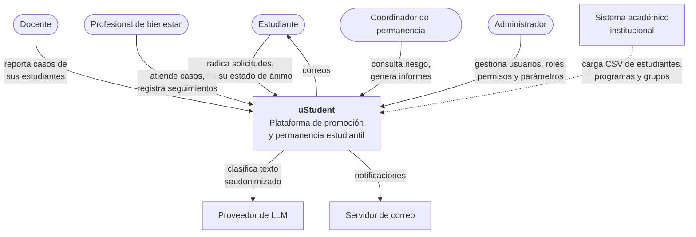

# C4 · Nivel 1 — Contexto del sistema

## Alcance del sistema

uStudent es el **sistema de registro** de los casos de bienestar y del índice de riesgo. No
es sistema de registro de la información académica: esa se importa y se trata como
referencia de solo lectura.

## Dependencias externas

| Sistema | Naturaleza | Qué pasa si falla |
|---|---|---|
| Sistema académico | Importación manual por CSV (v1) | Se opera con el último corte cargado |
| Proveedor de LLM | Síncrono, con timeout de 5 s | Actúa el clasificador de respaldo; el servicio sigue |
| Servidor SMTP | Asíncrono con reintento | Los avisos in-app siguen funcionando; los correos se reintentan |
