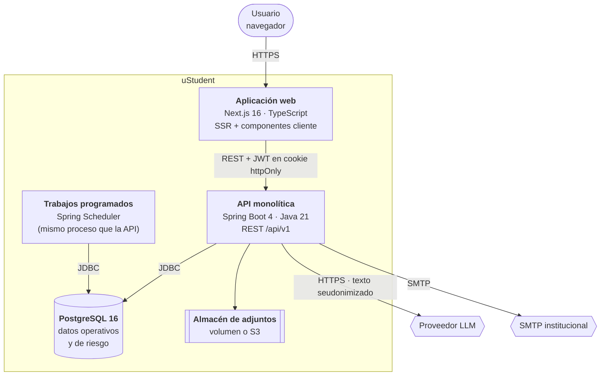

# C4 · Nivel 2 — Contenedores

## Contenedores

| Contenedor | Tecnología | Responsabilidad |
|---|---|---|
| Aplicación web | Next.js 16, TypeScript, Tailwind, TanStack Query | Interfaz por rol, renderizado en servidor de vistas protegidas, gráficas |
| API monolítica | Spring Boot 4, Java 21 | Toda la lógica de negocio, autorización, persistencia, integración con IA y correo |
| Trabajos programados | Spring Scheduler, dentro del mismo proceso | Recálculo diario de riesgo, reintento de trabajos asíncronos, purga de tokens |
| Base de datos | PostgreSQL 16 | Almacén único, incluido el detalle de riesgo en JSONB |
| Almacén de adjuntos | Volumen del contenedor en dev; S3 compatible en producción | Archivos de los casos, fuera de la BD |

## Por qué los trabajos van en el mismo proceso

Un proceso aparte solo aportaría aislamiento de recursos, que a esta escala no es problema, a
cambio de duplicar despliegue y configuración. Si el recálculo llegara a competir con el
tráfico interactivo, se separa activando el mismo artefacto con un perfil `worker`: no
requiere cambios de código, solo de despliegue.

## Comunicación

| Origen | Destino | Protocolo | Notas |
|---|---|---|---|
| Web → API | REST/JSON sobre HTTPS | Cookie `httpOnly` + anti-CSRF; CORS restringido por entorno |
| API → PostgreSQL | JDBC con pool HikariCP | Migraciones por Flyway al arranque |
| API → LLM | HTTPS/JSON | Timeout 5 s, 2 reintentos, disyuntor abierto tras 5 fallos seguidos |
| API → SMTP | SMTP con TLS | Encolado en `sys_async_jobs`, con reintento exponencial |
