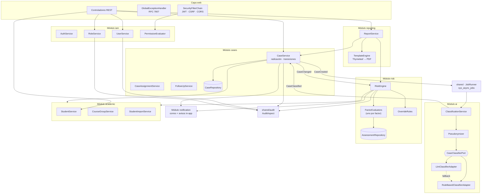

# C4 · Nivel 3 — Componentes del backend

Detalle interno del contenedor «API monolítica». Cada bloque es un módulo con sus capas.

## Componentes clave

| Componente | Responsabilidad | Nota de diseño |
|---|---|---|
| `CaseService` | Radicar, transicionar y cerrar casos; publica eventos de dominio | Único punto donde se abre transacción para casos |
| `PermissionEvaluator` | Resuelve `hasAuthority('recurso:acción')` desde el token | Se integra con `@PreAuthorize`; no consulta la BD en cada petición |
| `ClassificationService` | Orquesta seudonimización, llamada al puerto, validación y persistencia | No conoce al proveedor concreto |
| `Pseudonymizer` | Elimina identificadores antes de salir del sistema | Se prueba con casos límite: nombres compuestos, documentos con puntos |
| `RiskEngine` | Suma ponderada, aplica anulaciones, persiste el desglose | Puro y determinista; sin acceso a BD, recibe un `RiskInput` ya cargado |
| `FactorEvaluators` | Un evaluador por factor, todos con la misma interfaz | Agregar un factor = agregar una clase + una fila de configuración |
| `AuditAspect` | Intercepta `@Audited` y escribe la bitácora | Fuera del hilo de la transacción de negocio |
| `JobRunner` | Toma trabajos pendientes, reintenta con retroceso exponencial | Sustituible por un broker sin tocar el dominio |

## Por qué `RiskEngine` es puro

Recibe un objeto de entrada ya materializado (casos, check-ins, matrícula) y devuelve la
evaluación. Al no tocar la base de datos ni el reloj del sistema, se prueba exhaustivamente
con tablas de casos, que es exactamente lo que exige el
[RNF-M1](../../01-requisitos/requisitos-no-funcionales.md): 100 % de cobertura de las reglas
de riesgo.
