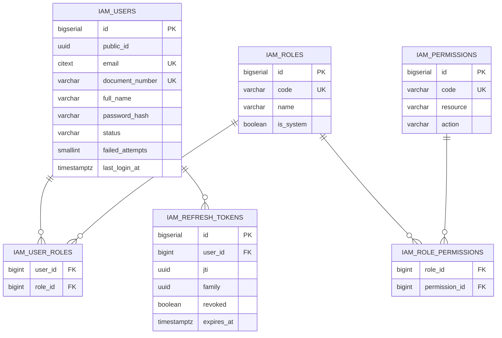
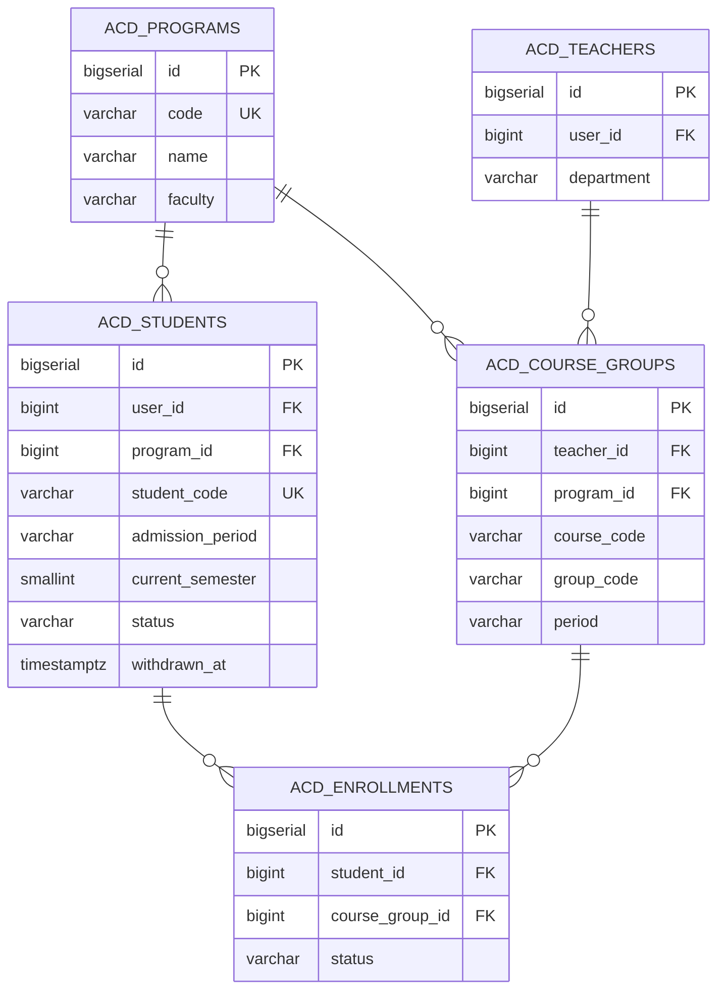
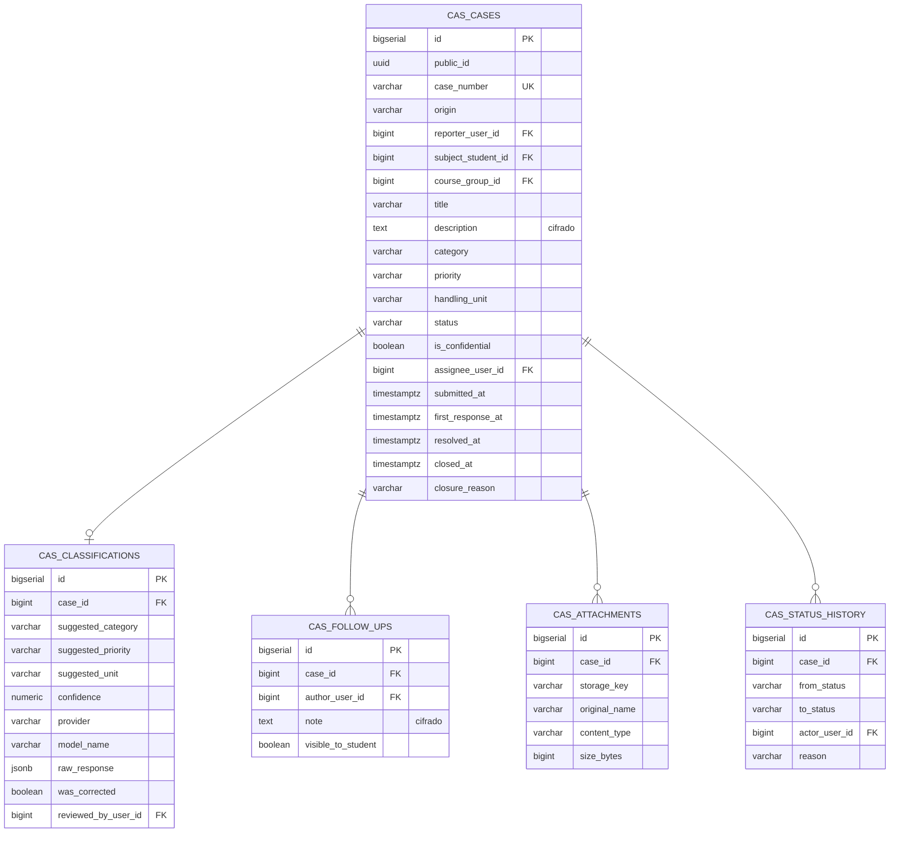
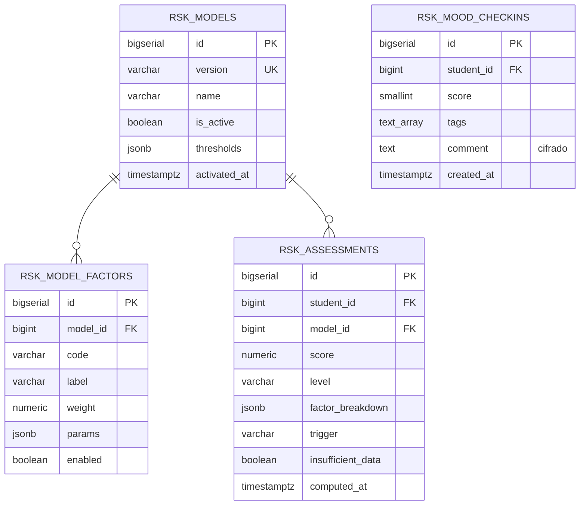
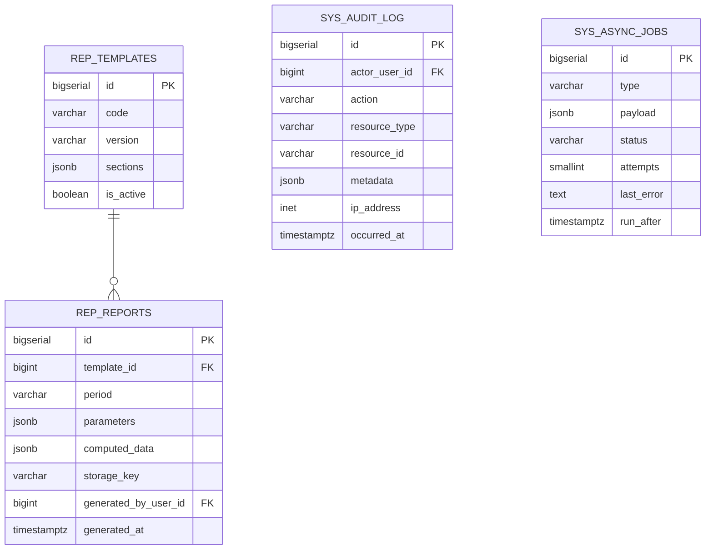

# Modelo entidad-relación (detalle)

Complemento gráfico de [`docs/02-arquitectura/modelo-datos.md`](../../02-arquitectura/modelo-datos.md).

## Identidad y acceso

## Académico

## Casos

## Riesgo

## Reportes y sistema

