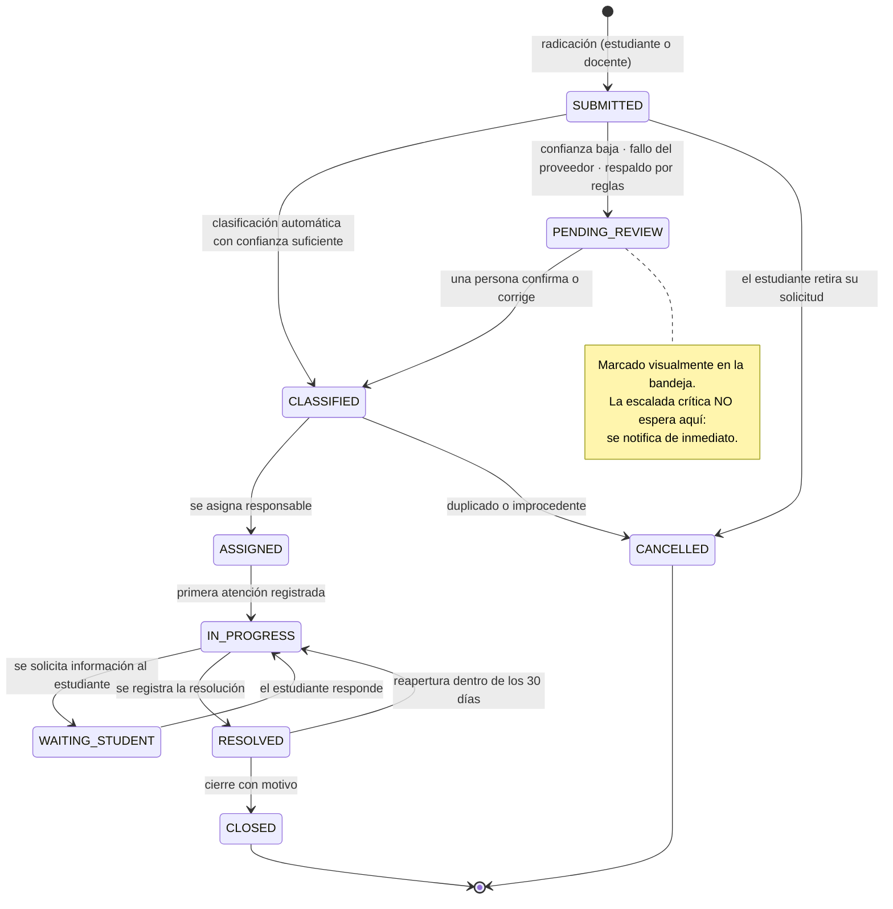

# Ciclo de vida de un caso

## Estados

| Estado | Significado | Quién lo produce |
|---|---|---|
| `SUBMITTED` | Radicado, sin clasificar | Sistema, al crear |
| `PENDING_REVIEW` | Necesita revisión humana de la clasificación | Sistema |
| `CLASSIFIED` | Categoría, prioridad y área definidas | Sistema o persona |
| `ASSIGNED` | Con responsable nombrado | Coordinador o asignación automática por área |
| `IN_PROGRESS` | En atención, con al menos un seguimiento | Profesional |
| `WAITING_STUDENT` | Esperando respuesta del estudiante | Profesional |
| `RESOLVED` | Atendido, pendiente de cierre formal | Profesional |
| `CLOSED` | Cerrado con motivo | Profesional o coordinador |
| `CANCELLED` | Retirado o improcedente | Estudiante (propio) o coordinador |

## Reglas de transición

1. Las transiciones no listadas en el diagrama devuelven `409 CASE_INVALID_TRANSITION`.
2. `CLOSED` exige `closureReason` de la lista: `SOLVED`, `REFERRED_EXTERNAL`,
   `NO_STUDENT_RESPONSE`, `DUPLICATE`, `OUT_OF_SCOPE`, `STUDENT_WITHDREW`.
3. Pasar a `IN_PROGRESS` por primera vez fija `first_response_at`, base del indicador de
   tiempo de respuesta.
4. Un caso `CLOSED` no se reabre: se radica uno nuevo enlazado al anterior. `RESOLVED` sí
   admite reapertura dentro de 30 días.
5. Toda transición se registra en `cas_status_history` con actor, motivo y marca de tiempo.
6. Un caso `CRITICAL` no puede pasar a `CLOSED` sin al menos un seguimiento registrado.
7. El estudiante solo puede cancelar sus propias solicitudes y solo mientras estén en
   `SUBMITTED`.
8. Cada transición dispara el recálculo del riesgo del estudiante sujeto.
