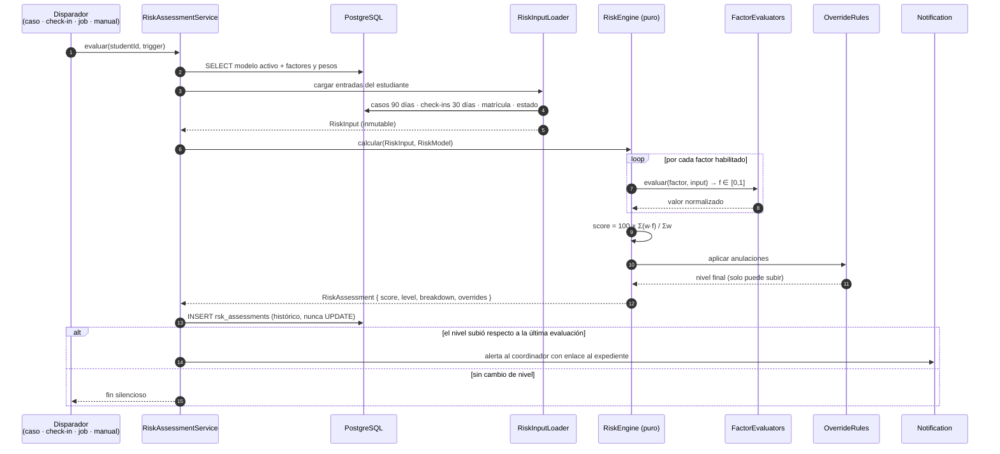
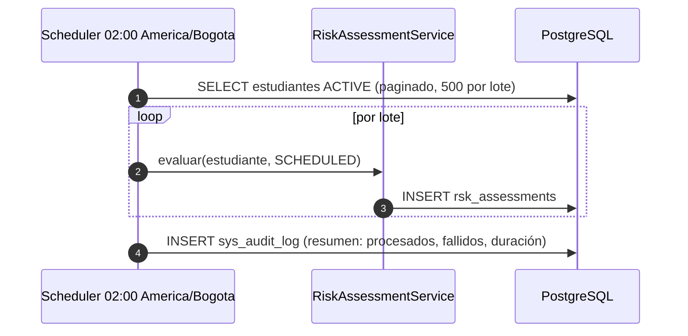

# Secuencia · Cálculo del índice de riesgo

## Job programado diario

Un fallo en un estudiante no aborta el lote: se registra y se continúa. El resumen final
indica cuántos quedaron sin recalcular.

## Invariantes del cálculo

| # | Invariante |
|---|---|
| I1 | El motor es **puro**: mismas entradas y mismo modelo ⇒ mismo resultado. No lee el reloj ni la base de datos. |
| I2 | Toda evaluación guarda la **versión del modelo** usada; las históricas no se recalculan al cambiar los pesos. |
| I3 | El desglose por factor es obligatorio; sin él la evaluación no se persiste. |
| I4 | Las anulaciones solo **elevan** el nivel, nunca lo bajan. |
| I5 | Se inserta siempre una fila nueva: el histórico es inmutable y permite graficar tendencia. |
| I6 | Un estudiante sin datos suficientes obtiene `score = 0` y `level = LOW`, marcado con `insufficientData: true` para no confundir «sin señales» con «sin riesgo». |
