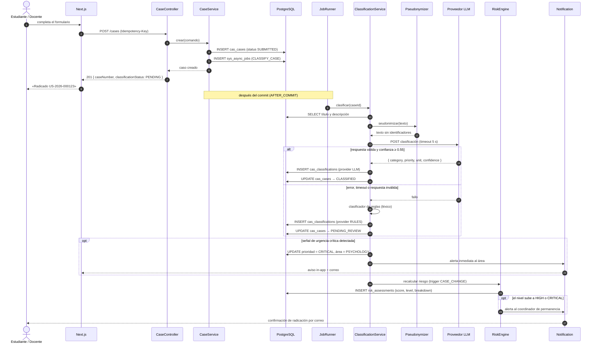

# Secuencia · Radicación y clasificación de un caso

## Puntos de diseño

| # | Decisión | Motivo |
|---|---|---|
| 1 | La respuesta 201 no espera a la IA | Cumple el [RNF-P2](../../01-requisitos/requisitos-no-funcionales.md): radicar responde en < 1 s |
| 2 | El trabajo se encola **en la misma transacción** que el caso | Si el caso se persiste, su clasificación está garantizada; si falla, no queda trabajo huérfano |
| 3 | `Idempotency-Key` en el POST | Un doble clic o un reintento de red no crea dos radicados |
| 4 | La detección de urgencia corre con ambos clasificadores | La red de seguridad no puede depender de un proveedor externo |
| 5 | El recálculo de riesgo ocurre tras clasificar, no al radicar | La categoría es entrada de varios factores; hacerlo antes daría un puntaje incompleto |
| 6 | La seudonimización ocurre dentro del servicio, no en el adaptador | Ningún adaptador futuro puede saltársela por olvido |
