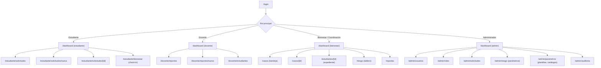

# Mapa de navegación

El menú se construye a partir de los permisos del token. Ocultar no autoriza: el servidor
verifica siempre ([modelo de seguridad](../02-arquitectura/seguridad.md)).

## Pantallas por rol

### Estudiante

| Pantalla | Contenido |
|---|---|
| Panel | Estado de sus solicitudes abiertas, recordatorio de check-in, accesos rápidos |
| Nueva solicitud | Formulario de un paso: categoría opcional, descripción, adjuntos, casilla de confidencialidad |
| Mis solicitudes | Lista con radicado, categoría, estado y última actualización |
| Detalle | Línea de tiempo, seguimientos visibles, opción de responder o cancelar |
| Bienestar | Check-in de ánimo (3 toques), historial propio, recursos de apoyo |

No ve: puntaje de riesgo, casos de otros, seguimientos internos.

### Docente

| Pantalla | Contenido |
|---|---|
| Panel | Sus grupos, reportes recientes, acceso directo a «Reportar inasistencia» |
| Nuevo reporte | Buscar estudiante (solo de sus grupos) → tipo de situación → descripción |
| Mis reportes | Los que él radicó, con su estado actual |
| Mis estudiantes | Listado por grupo, sin información sensible ni puntaje de riesgo |

### Bienestar / Coordinación

| Pantalla | Contenido |
|---|---|
| Bandeja | Filtros por estado, prioridad, categoría y antigüedad; los `PENDING_REVIEW` y `CRITICAL` van arriba |
| Detalle del caso | Datos, clasificación sugerida con confianza, línea de tiempo, seguimientos, transiciones |
| Expediente del estudiante | Todos sus casos, check-ins, evaluaciones de riesgo con desglose |
| Tablero de riesgo | Distribución por nivel, tendencia, factores dominantes, filtros por programa |
| Reportes | Generar informe institucional, historial de informes |

### Administrador

| Pantalla | Contenido |
|---|---|
| Usuarios | CRUD, asignación de roles, activación/desactivación, importación CSV |
| Roles y permisos | Matriz editable de rol × permiso |
| Solicitudes | Vista global de todos los casos, incluidos los confidenciales |
| Parámetros de riesgo | Factores, pesos, umbrales; versionado del modelo con vista previa del impacto |
| Plantillas y catálogos | Plantillas de reporte, textos de recursos de apoyo, categorías visibles |
| Auditoría | Bitácora filtrable por usuario, acción, recurso y fecha |

## Estructura de la interfaz

- **Barra lateral** fija en escritorio, colapsable en tableta, inferior en móvil. Fondo
  `blue-900`, ítem activo con barra turquesa a la izquierda.
- **Cabecera** con buscador contextual, campana de notificaciones y menú de usuario.
- **Contenido** sobre `neutral-50`, tarjetas blancas, ancho máximo 1280 px.
- **Migas de pan** en toda vista de detalle.

## Recorridos críticos y su presupuesto de interacción

| Recorrido | Pasos máximos |
|---|---|
| Docente reporta inasistencia | 4 interacciones desde el panel |
| Estudiante radica solicitud | 3 campos, 1 pantalla |
| Estudiante hace check-in | 3 toques |
| Profesional atiende un caso de la bandeja | 2 clics desde el panel |
| Admin genera el reporte del período | 3 clics |
