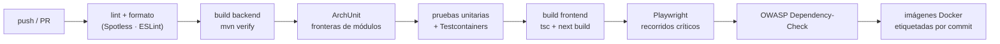

# Entornos y despliegue

## Entornos

| Entorno | Propósito | Datos | Perfil Spring |
|---|---|---|---|
| `local` | Desarrollo en la máquina del desarrollador | Semillas sintéticas | `local` |
| `dev` | Integración continua, pruebas automáticas | Sintéticos, se recrean en cada despliegue | `dev` |
| `staging` | Validación con el área de bienestar | Anonimizados a partir de producción | `staging` |
| `prod` | Uso institucional | Reales | `prod` |

Regla firme: **nunca** datos reales fuera de `prod`. El proceso de anonimización para
`staging` está en `tools/scripts/anonymize-dump`.

## Variables de entorno

```bash
# Base de datos
DB_URL=jdbc:postgresql://localhost:5432/ustudent
DB_USER=ustudent
DB_PASSWORD=

# Seguridad
JWT_PRIVATE_KEY_PATH=/run/secrets/jwt_private.pem
JWT_PUBLIC_KEY_PATH=/run/secrets/jwt_public.pem
DATA_ENCRYPTION_KEY=           # AES-256 en base64, para campos sensibles
CORS_ALLOWED_ORIGINS=http://localhost:3000

# IA
AI_ENABLED=true
AI_PROVIDER=anthropic          # anthropic | rules
AI_MODEL=claude-sonnet-5
AI_API_KEY=
AI_TIMEOUT_MS=5000

# Correo
SMTP_HOST=
SMTP_PORT=587
SMTP_USER=
SMTP_PASSWORD=

# Adjuntos
STORAGE_TYPE=filesystem        # filesystem | s3
STORAGE_PATH=/var/ustudent/attachments

# Frontend
NEXT_PUBLIC_API_URL=http://localhost:8080/api/v1
```

`.env.example` en la raíz documenta todas; `.env` está en `.gitignore`. Ningún secreto entra
al repositorio.

## Composición local

`infra/docker/docker-compose.yml` levanta PostgreSQL 16, MailHog (correo de prueba en
`localhost:8025`) y, opcionalmente, MinIO para probar el almacenamiento S3. El backend y el
frontend se ejecutan fuera de Docker en desarrollo, para tener recarga en caliente.

## Migraciones

- Flyway se ejecuta al arrancar la aplicación (`spring.flyway.enabled=true`).
- Convención de nombre: `V<versión>__<descripcion_en_snake_case>.sql`.
- Las migraciones aplicadas **nunca** se editan: se corrige con una nueva.
- Los datos semilla (permisos, roles del sistema, modelo de riesgo inicial, catálogos) van
  en migraciones `R__seed_*.sql` repetibles e idempotentes.
- Toda migración debe ser compatible hacia atrás una versión: primero se añade la columna,
  luego se despliega el código que la usa, y solo después se elimina la anterior.

## Pipeline de CI



El pipeline falla, y no se despliega, si: cae la cobertura por debajo del umbral, ArchUnit
detecta una violación de frontera, hay una dependencia con vulnerabilidad crítica, o el
contraste de un par de tokens de color queda por debajo del mínimo.

## Despliegue

- Artefactos: dos imágenes Docker (`ustudent-api`, `ustudent-web`) etiquetadas con el SHA del
  commit. Nunca se despliega `latest`.
- Estrategia: reemplazo con verificación de salud (`/actuator/health/readiness`) antes de
  cortar el tráfico.
- Reversión: volver a la etiqueta anterior. Si la versión incluía una migración destructiva,
  la reversión exige restaurar respaldo — de ahí la regla de compatibilidad hacia atrás.

## Respaldos

| Qué | Frecuencia | Retención | Verificación |
|---|---|---|---|
| Base de datos (`pg_dump`) | Diaria, 01:00 | 30 días | Restauración de prueba mensual en `staging` |
| Adjuntos | Diaria, incremental | 30 días | Recuento de objetos |
| Claves y secretos | Al rotar | Gestor de secretos | Fuera del repositorio y de los respaldos de BD |

## Rotación de claves

1. Generar el nuevo par RSA y publicarlo como clave de **verificación** adicional.
2. Desplegar: la aplicación firma con la clave nueva y verifica con ambas.
3. Esperar a que expire el token de refresco más largo (8 h).
4. Retirar la clave antigua.

Para `DATA_ENCRYPTION_KEY` el procedimiento exige recifrado por lotes, con el identificador
de versión de clave almacenado junto a cada valor cifrado.

## Tareas programadas

| Tarea | Horario (`America/Bogota`) |
|---|---|
| Recálculo de riesgo | 02:00 diario |
| Reintento de trabajos fallidos | Cada 5 min |
| Purga de tokens de refresco expirados | 03:00 diario |
| Recordatorio de check-in | Lunes 08:00 |
| Anonimización de casos con más de 5 años | 1.º de cada mes, 04:00 |
