# Plan de desarrollo

Ocho fases, pensadas para un semestre académico (~16 semanas desde el 13 de agosto de 2026).
Cada fase termina en algo **demostrable**: al final de cada una hay una funcionalidad que se
puede enseñar y usar, no una capa técnica a medio conectar.

Principio rector: **atravesar el sistema de punta a punta lo antes posible**. La fase 1
entrega login funcionando desde el navegador hasta la base de datos. Todo lo demás se apoya
en ese esqueleto ya probado.

```mermaid
gantt
  title uStudent · fases de desarrollo (semanas)
  dateFormat X
  axisFormat S%d
  section Base
  F0 Cimientos            :f0, 0, 1
  F1 Identidad y acceso   :f1, after f0, 2
  section Núcleo
  F2 Casos · radicación   :f2, after f1, 3
  F3 Casos · atención     :f3, after f2, 2
  section Diferenciadores
  F4 IA + check-in ánimo  :f4, after f3, 2
  F5 Motor de riesgo      :f5, after f4, 3
  F6 Reportes             :f6, after f5, 2
  section Cierre
  F7 Endurecimiento       :f7, after f6, 2
```

---

## Fase 0 · Cimientos — 1 semana

**Objetivo**: que cualquier integrante clone el repositorio y tenga el entorno corriendo en
menos de 15 minutos.

| # | Tarea | Entregable |
|---|---|---|
| 0.1 | Inicializar Git, `.gitignore`, `.editorconfig`, convención de commits | Repositorio con historia limpia |
| 0.2 | Proyecto Spring Boot 4.1 / Java 21 con la estructura de módulos ya definida | `./mvnw spring-boot:run` levanta y responde `/actuator/health` |
| 0.3 | Proyecto Next.js 16 con TypeScript, Tailwind y los tokens del sistema de diseño | `npm run dev` muestra la pantalla base con la paleta |
| 0.4 | `docker-compose` con PostgreSQL y MailHog | `docker compose up -d` deja la BD lista |
| 0.5 | Flyway con `V1__initial_schema.sql` (usuarios, roles, permisos) | Migración aplicada al arrancar |
| 0.6 | Manejo global de errores RFC 7807 + OpenAPI + CORS | `/swagger-ui.html` operativo |
| 0.7 | Pruebas de arquitectura ArchUnit con las reglas de módulos | Build falla si se viola una frontera |
| 0.8 | Pipeline de CI: lint, build, pruebas | Verde en el primer PR |

**Criterio de salida**: pipeline verde, entorno reproducible, un endpoint de prueba
consumido desde el frontend.

---

## Fase 1 · Identidad y acceso — 2 semanas

**Objetivo**: iniciar sesión y que el menú se arme según los permisos reales.

**Historias**: US-E1-1, US-E1-2, US-E1-3, US-E7-2, US-E7-3

| # | Tarea |
|---|---|
| 1.1 | Modelo `iam`: usuarios, roles, permisos, tablas puente, refresh tokens |
| 1.2 | `AuthService`: login, refresco rotatorio, logout, bloqueo por intentos |
| 1.3 | Emisión y verificación de JWT RS256 en cookie `httpOnly` |
| 1.4 | `PermissionEvaluator` + `@PreAuthorize` por permiso atómico |
| 1.5 | Semilla de los 5 roles y del catálogo completo de permisos |
| 1.6 | CRUD de usuarios y de roles con asignación de permisos |
| 1.7 | Frontend: login, layout autenticado, barra lateral por permisos, guardas de ruta |
| 1.8 | Componentes base del sistema de diseño: `Button`, `Input`, `Card`, `Table`, `Badge`, `Modal`, `Toast` |
| 1.9 | Pruebas de autorización: cada endpoint con su caso 403 |

**Criterio de salida**: un administrador crea un usuario docente, le asigna rol, y ese
docente entra y ve **solo** su menú. Cambiar un permiso cambia lo que ve.

**Riesgo**: la integración de cookies entre Next.js y Spring Security suele consumir más
tiempo del esperado. Atacarla el primer día de la fase, no el último.

---

## Fase 2 · Casos · radicación — 3 semanas

**Objetivo**: que estudiantes y docentes radiquen; que el caso quede en el expediente correcto.

**Historias**: US-E1-4, US-E2-1 a US-E2-5, US-E1-5

| # | Tarea |
|---|---|
| 2.1 | Modelo `academic`: programas, estudiantes, docentes, grupos, matrículas |
| 2.2 | Importación CSV con validación fila a fila y reporte de errores |
| 2.3 | Modelo `cases` + máquina de estados + `cas_status_history` |
| 2.4 | `POST /cases` para ambos orígenes, con `Idempotency-Key` y numeración de radicado |
| 2.5 | Cifrado en reposo de `description` (conversor JPA) |
| 2.6 | Listados con filtros, paginación y **alcance por rol** (reglas R1–R4) |
| 2.7 | Adjuntos: carga, validación de tipo y tamaño, almacenamiento fuera de la BD |
| 2.8 | Frontend estudiante: nueva solicitud, mis solicitudes, detalle con línea de tiempo |
| 2.9 | Frontend docente: buscador de estudiantes de sus grupos, reporte corto de inasistencia |
| 2.10 | Auditoría de accesos a casos ajenos |

**Criterio de salida**: un docente reporta inasistencia en menos de 1 minuto; el caso aparece
en el expediente del estudiante; el estudiante ve su propia solicitud pero **no** la del
docente si no le corresponde.

**Riesgo**: el alcance por fila es el punto donde se cometen los errores de seguridad más
caros. Escribir primero las pruebas de alcance, después la consulta.

---

## Fase 3 · Casos · atención — 2 semanas

**Objetivo**: cerrar el ciclo de vida completo del caso.

**Historias**: US-E3-1 a US-E3-5, US-E2-6, US-E7-1

| # | Tarea |
|---|---|
| 3.1 | Transiciones de estado con validación de la máquina y motivos de cierre |
| 3.2 | Asignación y reasignación, individual y por lotes |
| 3.3 | Seguimientos con visibilidad configurable para el estudiante |
| 3.4 | Expediente del estudiante: línea de tiempo consolidada |
| 3.5 | Módulo `notification`: correo + avisos in-app sobre `sys_async_jobs` |
| 3.6 | Frontend: bandeja con filtros, detalle del caso, panel de acciones |
| 3.7 | Consulta de auditoría para el administrador |
| 3.8 | Métricas de servicio: `first_response_at`, tiempos por prioridad |

**Criterio de salida**: recorrido completo radicar → clasificar a mano → asignar → atender →
resolver → cerrar, con el estudiante notificado en cada paso.

---

## Fase 4 · Clasificación con IA y check-in de ánimo — 2 semanas

**Objetivo**: los dos ingredientes que alimentan el motor de riesgo.

**Historias**: US-E4-1, US-E4-2, US-E4-3, US-E4-5, US-E5-1

| # | Tarea |
|---|---|
| 4.1 | `CaseClassifierPort` + `RuleBasedClassifierAdapter` con el léxico en español |
| 4.2 | `Pseudonymizer` con pruebas de casos límite (nombres compuestos, documentos con puntos) |
| 4.3 | `LlmClassifierAdapter` con timeout, reintento, disyuntor y validación por esquema |
| 4.4 | `JobRunner` y clasificación asíncrona tras el commit |
| 4.5 | Detección de señales de urgencia y escalada automática con notificación inmediata |
| 4.6 | Persistencia de sugerencia vs. decisión humana (`was_corrected`) |
| 4.7 | Frontend: `ClassificationSuggestion` con confianza, aceptar / corregir |
| 4.8 | Check-in de ánimo: modelo, endpoint, `MoodScale`, historial propio |

**Criterio de salida**: se radica un caso, se clasifica solo en menos de 30 s, y **apagando
las credenciales del proveedor el sistema sigue funcionando** con el respaldo de reglas.

**Riesgo**: el prompt es la parte que más iteración pide. Reservar tiempo para un conjunto
de ~40 casos de prueba etiquetados a mano con los que medir la precisión.

---

## Fase 5 · Motor de riesgo — 3 semanas

**Objetivo**: el diferenciador del producto.

**Historias**: US-E5-2 a US-E5-6, US-E4-4

| # | Tarea |
|---|---|
| 5.1 | Modelo `rsk_models` / `rsk_model_factors` + semilla de la versión 1.0.0 |
| 5.2 | `RiskInputLoader`: carga de casos, check-ins y matrícula del estudiante |
| 5.3 | `RiskEngine` **puro** con los 8 evaluadores de factor |
| 5.4 | Reglas de anulación OV-1 a OV-4 |
| 5.5 | Persistencia de evaluaciones con desglose e histórico inmutable |
| 5.6 | Disparadores: cambio de caso, check-in, job diario, manual |
| 5.7 | Alertas por cambio de nivel |
| 5.8 | Panel de administración de pesos y umbrales, con versionado |
| 5.9 | Frontend: `RiskBreakdown`, tablero de riesgo, serie histórica |
| 5.10 | Pruebas del motor al 100 % de cobertura, con tabla de casos |

**Criterio de salida**: el desglose del ejemplo trabajado de la
[especificación](../03-especificaciones/reglas/motor-riesgo-desercion.md) se reproduce
exactamente en la aplicación, y cambiar un peso desde el panel cambia el resultado del
siguiente cálculo sin tocar los históricos.

**Riesgo**: la tentación de meter lógica de riesgo en varios sitios. Regla dura: **todo el
cálculo vive en `RiskEngine`**; los evaluadores no consultan la base de datos.

---

## Fase 6 · Reportes institucionales — 2 semanas

**Historias**: US-E6-1, US-E6-2, US-E6-3

| # | Tarea |
|---|---|
| 6.1 | Modelo de plantillas versionadas y su gestión |
| 6.2 | Consultas agregadas por período, programa, categoría y nivel de riesgo |
| 6.3 | Umbral de anonimato (`< 5`) aplicado a todo agregado |
| 6.4 | Render Thymeleaf → HTML → PDF con las 10 secciones de la plantilla |
| 6.5 | Exportación CSV con verificación de permisos |
| 6.6 | Frontend: generar, listar, previsualizar y descargar informes |
| 6.7 | Tablero de precisión del clasificador |

**Criterio de salida**: generar el informe del período 2026-2 en menos de 60 s, con las
cifras cuadrando contra consultas SQL hechas a mano.

---

## Fase 7 · Endurecimiento y entrega — 2 semanas

| # | Tarea |
|---|---|
| 7.1 | Prueba de carga (k6) contra los RNF-P1 a P4 y ajuste de índices |
| 7.2 | Revisión OWASP ASVS nivel 1 y corrección de hallazgos |
| 7.3 | Auditoría de accesibilidad AA en los recorridos críticos |
| 7.4 | E2E Playwright de los cinco recorridos principales |
| 7.5 | Manual de usuario por rol y guía de despliegue |
| 7.6 | Datos de demostración realistas y sintéticos |
| 7.7 | **Calibración del motor de riesgo** contra los retiros reales del período |
| 7.8 | Preparación de la sustentación / entrega institucional |

**Criterio de salida**: sistema desplegado en `staging`, validado por el área de bienestar,
con documentación completa y el informe de calibración del motor de riesgo.

---

## Resumen de hitos

| Hito | Fin de fase | Se puede demostrar |
|---|---|---|
| H1 | 0 | Entorno reproducible, CI verde |
| H2 | 1 | Login y menú por permisos |
| H3 | 2 | Radicación por estudiante y docente |
| H4 | 3 | Ciclo de vida completo del caso |
| H5 | 4 | Clasificación automática con respaldo |
| H6 | 5 | Índice de riesgo explicable |
| H7 | 6 | Informe institucional en PDF |
| H8 | 7 | Sistema listo para entrega |

## Orden de trabajo dentro de cada tarea

1. Migración Flyway y entidad de dominio.
2. Reglas de dominio, **con sus pruebas unitarias primero**.
3. Servicio de aplicación con la transacción y la verificación de permiso.
4. Controlador y DTO.
5. Prueba de integración con Testcontainers, incluida la de autorización (403).
6. Regeneración de tipos del frontend desde OpenAPI.
7. Interfaz, con estados de carga, error y vacío.

Ninguna tarea se considera terminada sin la
[definición de terminado](definicion-de-terminado.md).

## Qué hacer si el tiempo aprieta

Recorte en este orden, de lo primero a sacrificar a lo último:

1. Exportación CSV y gestión de plantillas (queda una plantilla fija en código).
2. Tablero de precisión del clasificador.
3. Adjuntos en los casos.
4. `LlmClassifierAdapter` — se entrega solo con el clasificador de reglas, que ya cumple
   la promesa funcional aunque con menor precisión.

**No se recorta nunca**: el alcance por rol, la auditoría, el desglose explicable del riesgo
ni la detección de señales de urgencia. Son las partes que protegen a las personas.
